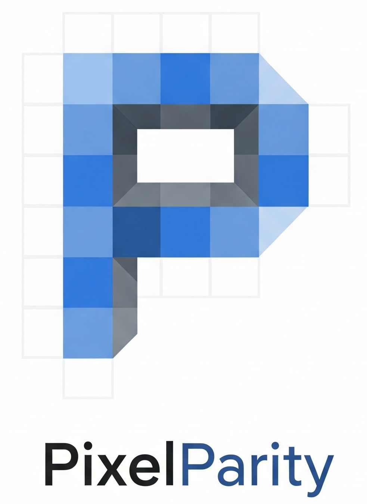

# PixelParity — Precision Display Metrics




Professional display metrics for developers and QA. Instantly see viewport size,
screen resolution, zoom level, device pixel ratio, and responsive breakpoints in
a clean, accessible UI.

## 🚀 Features

- Real-time metrics: viewport, screen, document, and computed aspect ratio
- Zoom level and device pixel ratio detection
- Responsive breakpoints with active highlight
  - XS (0–575), SM (576–767), MD (768–991), LG (992–1199), XL (1200–1399), XXL
    (≥1400)
- Copy/export in three formats: JSON, CSS custom properties, and table
- Light/Dark themes with system preference detection and persistence
- Compact Mode option to reduce popup footprint
- Keyboard shortcuts for fast copy actions (with correct Ctrl/⌘ hinting)
- Privacy-first: no tracking, no external requests, minimal permissions

## 📦 Installation

### Chrome Web Store

- Listing link coming soon

### Load Unpacked (Development)

1. Clone the repo
2. Go to chrome://extensions and enable Developer mode
3. Click “Load unpacked” and select the project root folder

## 🎯 Usage

1. Open any website
2. Open PixelParity from the toolbar (or Alt+Shift+V)
3. View metrics, breakpoints, and actions
4. Copy as JSON/CSS/Table or tweak Settings (theme, compact mode)

### Keyboard Shortcuts

- Open extension: Alt+Shift+V
- Copy as JSON: Ctrl/⌘ + J
- Copy as CSS variables: Ctrl/⌘ + S
- Copy as Table: Ctrl/⌘ + T
- Refresh metrics: Ctrl/⌘ + R
- Toggle theme: Ctrl/⌘ + D

Note: The popup displays the proper modifier for your OS automatically.

## � How it works (Architecture)

- `js/metrics-detector.js` — Injects a small function into the active page using
  the MV3 Scripting API to read safe, in-page properties (viewport, screen,
  typography, DPR, zoom) and returns a plain object.
- `js/ui-controller.js` — Renders loading/error/success states, metrics grid,
  breakpoints, theme + compact toggles, and handles copy feedback.
- `js/app.js` — Orchestrates initialization, keyboard shortcuts, export actions,
  and error handling.
- `js/config.js` — Constants (breakpoints, export templates, storage keys).
- `js/utils.js` — Small helpers (debounce/throttle, timestamp, dark-mode query).
- `popup.html / popup.css / popup.js` — The popup UI shell and bootstrap.

## �️ Permissions

From `manifest.json` (MV3):

- `activeTab` — Access the current tab only when you interact with the
  extension.
- `scripting` — Inject the metrics function into the active tab to read display
  properties.
- `storage` — Persist lightweight settings (theme, compact mode) locally.

No remote code, no analytics, no network calls.

## ⚠️ Limitations

- Restricted pages: Browsers block extensions on internal pages like
  `chrome://*`, `edge://*`, `about:*`, and the Chrome Web Store
- Strict CSP sites may block script execution; you’ll see an error in the popup
- Orientation may be reported as `unknown` if not exposed by the page

## 📁 Project Structure

```text
pixelparity/
├── assets/
│   └── icons/
├── js/
│   ├── app.js
│   ├── metrics-detector.js
│   ├── config.js
│   ├── ui-controller.js
│   └── utils.js
├── manifest.json
├── popup.html
├── popup.css
├── popup.js
├── LICENSE
├── PRIVACY.md
└── README.md
```

## 🔒 Privacy

- No tracking, telemetry, or external requests
- Only stores theme, compact mode, and last detected metrics locally via
  `chrome.storage`
- Metrics are computed on the active page at the moment you open the popup

See [PRIVACY.md](PRIVACY.md) for details.

## 🐛 Troubleshooting

- “No active tab found” — Make sure a normal webpage tab is selected
- “Cannot access metrics on protected browser pages” — Try a regular site
  instead
- “Failed to extract metrics from page” — The page’s CSP may be blocking
  injection

## 📄 License

MIT — see [LICENSE](LICENSE)

## � Author

Abdallah Arslan — [@aaarslan](https://github.com/aaarslan)

## 🤝 Contributing

PRs welcome! Please fork, create a feature branch, and open a Pull Request.

—

Made for front-end developers who care about pixel-perfect UI.
